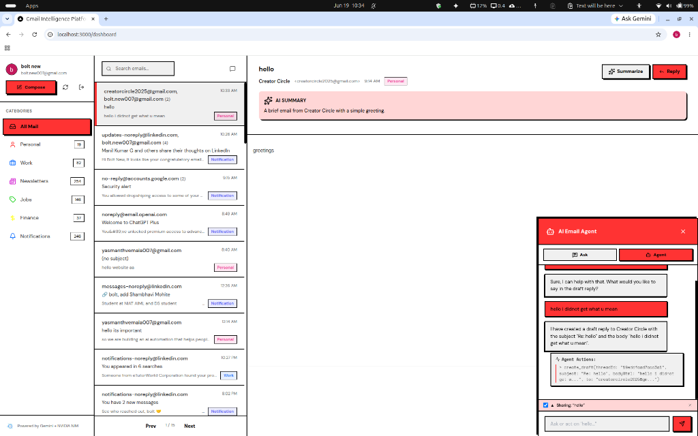
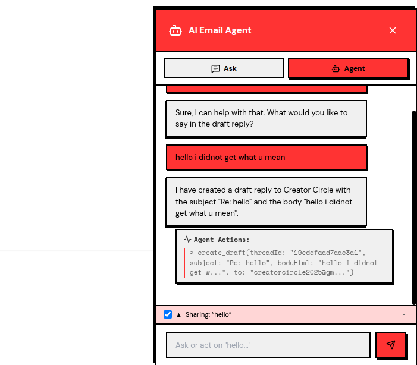
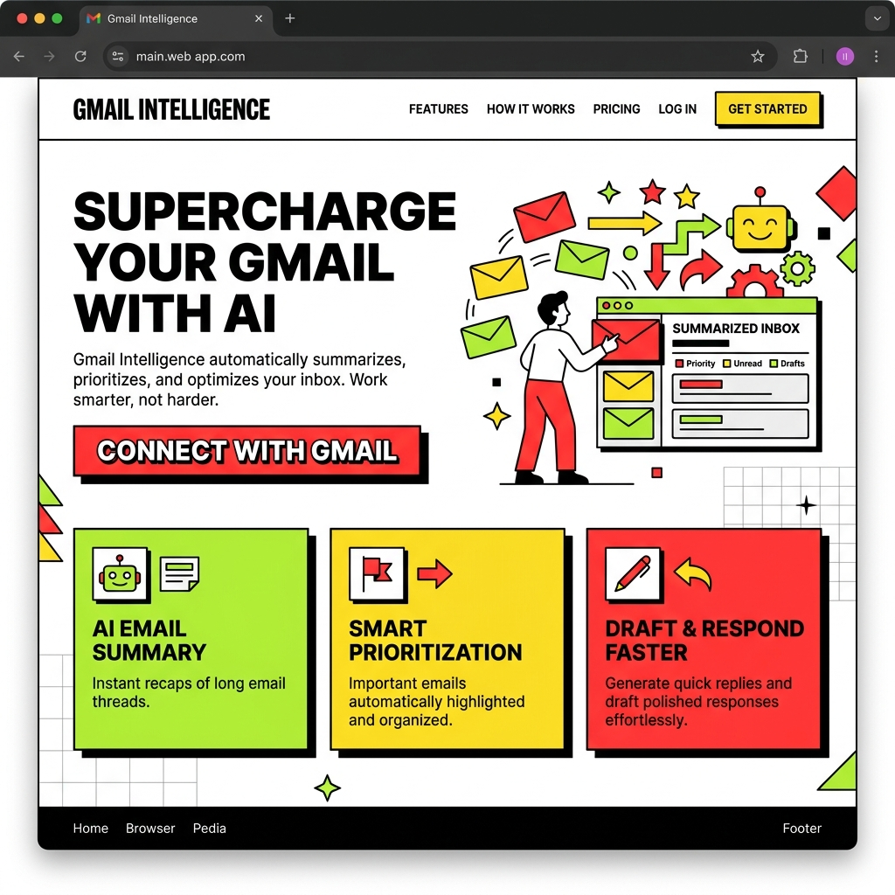

# Gmail Intelligence Platform (Repeatless)

An AI-powered Gmail Workspace intelligence dashboard. It connects to your Gmail account via OAuth, syncs and indexes emails to a local Supabase instance, categories and summarizes messages, supports AI-assisted compose/reply flows, and features a RAG-based Chat Agent capable of searching, reasoning, and executing actions over your mailbox.

---

## 📸 Visual Tour

### 1. Unified Intelligence Dashboard
The main interface displays a neobrutalism-inspired Gmail workspace featuring categorized email threads, real-time sync indicators, AI summaries, and the persistent AI Assistant panel.



### 2. AI Email Agent Panel
The interactive assistant operates in two modes: **Ask** (read-only semantic Q&A) and **Agent** (action-capable execution). Below shows the conversational interface executing draft creation tasks:



### 3. Official Landing Page
The marketing and landing page is designed using neobrutalism UI style with bold layouts, crisp fonts, flat contrasting colors, and interactive mockups showcasing platform capabilities.



---

## 🚀 Key Features

*   **Secure Gmail OAuth & Sync**: Full Google OAuth 2.0 integration with automatic token refreshing. Features a resumable initial sync via database queues and incremental syncs using Gmail history IDs.
*   **Thread-Aware Inbox**: Aggregates emails into logical conversational threads. Filter by categories (Personal, Work, Newsletters, Finance, Notifications, Jobs) or view a newsletter digest mode.
*   **AI Summaries**: Custom-tailored, context-aware summaries for individual emails and entire threads generated via Gemini.
*   **AI Compose & Reply**: Thread-aware draft generations, inline formatting controls, and support for multi-recipient mail.
*   **Ask & Agent Modes**:
    *   *Ask Mode*: Queries your inbox using semantic vector search and answers questions with direct email citations.
    *   *Agent Mode*: Executes actions like creating drafts, sending emails, archiving, starring/unstarving, or modifying labels.
*   **Toast Notification System**: Instant neobrutalism-style visual toast updates on the main UI for background agent actions (e.g. draft creation, send status, label updates).
*   **Semantic Search**: Supabase `pgvector` index executing cosine similarity searches over 768-dimensional Gemini embeddings.

---

## 🏛️ System Architecture

The application is built on Next.js 14 App Router, routing client requests, executing background sync loops, and serving API routes that orchestrate Gmail, Gemini, and Supabase.

```text
┌────────────────────────────────────────────────────────────────────┐
│ Frontend - Next.js App Router / React / Zustand                    │
│                                                                    │
│ Dashboard UI                                                       │
│   ├─ Sidebar: Categories, Compose, Real-time Sync Controls         │
│   ├─ EmailList: Threads, search input, newsletter digest toggle     │
│   ├─ EmailDetail: Reader, summaries, thread replies                │
│   └─ ChatPanel: Ask/Agent modes, reference sources, toasts         │
└───────────────────────────────┬────────────────────────────────────┘
                                │ API Requests
┌───────────────────────────────┴────────────────────────────────────┐
│ Backend - Next.js API Routes                                       │
│                                                                    │
│ /api/auth/*        OAuth URL, callbacks, session validation        │
│ /api/emails/*      Inbox listing, details, logs, sync engine       │
│ /api/chat          Gemini tool-calling orchestration agent         │
│ /api/compose       AI draft generation & MIME email sender         │
│ /api/reply         Thread-aware reply builder & sender            │
└───────────────┬───────────────────┬──────────────────┬─────────────┘
                │                   │                  │
                ▼                   ▼                  ▼
┌──────────────────────────┐ ┌───────────────┐ ┌───────────────┐
│ Gmail API                │ │ Google Gemini │ │ NVIDIA NIM    │
│ OAuth, message details,  │ │ Summaries,    │ │ Classifier,   │
│ send/drafts, labels,     │ │ Embeddings,   │ │ Rerank helper,│
│ history updates          │ │ Tool-calling  │ │ Deep analysis │
└───────────────┬──────────┘ └──────┬────────┘ └──────┬────────┘
                │                   │                 │
                ▼                   ▼                 ▼
┌────────────────────────────────────────────────────────────────────┐
│ Supabase PostgreSQL DB                                             │
│ Users, Emails, Threads, Sync status, Sync Queue                    │
│ pgvector IVFFlat index + match_emails() cosine similarity function │
└────────────────────────────────────────────────────────────────────┘
```

### Sync Pipeline & Queue Design
To prevent timeouts and rate-limiting issues on large mailboxes, the application operates a custom resumable sync pipeline:
1.  **Enumeration Phase**: The backend queries Gmail for message IDs in pages of 500. Message IDs are placed into the `sync_queue` table with a `pending` status.
2.  **Hydration Phase**: A fire-and-forget server loop processes messages from the queue in batches of 50. It fetches the full payload, extracts plain/HTML text, parses headers, runs categorization, generates embeddings/summaries, and upserts them into `emails`.
3.  **Aggregation Phase**: It rebuilds the `threads` table with updated message counts, participants, snippets, and dominant categories.
4.  **Incremental Sync**: Future triggers call `gmail.users.history.list` from the last synced `historyId` to sync only additions or label updates.

---

## 💾 Database Schema

The system uses a Supabase PostgreSQL backend enabled with `vector` and `pg_trgm` extensions:

*   **`users`**: Stores OAuth credentials, profile information, access tokens, refresh tokens, and expiry dates.
*   **`emails`**: Stored email metadata, HTML/text body contents, Gmail label IDs, AI summary, category, and `embedding` (`vector(768)`).
*   **`threads`**: Aggregate thread-level information including dominant category, participants, message count, and last message date.
*   **`sync_status`**: Stores synchronization cursors, current phase, discovered vs. hydrated counts, and error trackers.
*   **`sync_queue`**: Lightweight transactional table storing pending message IDs for resilient sync progress.

### pgvector Design
Gemini embeddings (`gemini-embedding-2`) are generated from a structured context string:
```text
Subject: <subject>
From: <from_name>
<body_text or snippet, truncated to 2000 characters>
```
The resulting 768-dimensional vectors are stored in the `embedding` column. Semantic search is executed using a custom PostgreSQL function `match_emails` performing cosine similarity calculations.

---

## 🛠️ Tech Stack

*   **Frontend**: React, Next.js 14 App Router, Zustand, Tailwind CSS, Lucide Icons, Lottie animations.
*   **Database**: Supabase (PostgreSQL, `pgvector`, Row-Level Security).
*   **API / Sync Integration**: Google APIs Client (`googleapis`), custom rate-limiter with backoff.
*   **AI Engine**: 
    *   **Google Gemini**: `gemini-2.5-flash` (for Q&A, tool calling, summarization, drafting) and `gemini-embedding-2` (for semantic vectors).
    *   **NVIDIA NIM**: `meta/llama-3.1-8b-instruct` (classification & reranking) and `nvidia/nemotron-3-ultra-550b-a55b` (deep reasoning).

---

## ⚙️ Prerequisites & Setup

### Prerequisites
*   Node.js 20+
*   Google Cloud Console Project with **Gmail API** enabled and configured OAuth Consent Screen.
*   Supabase Account & Project.
*   Google Gemini API Key.
*   NVIDIA NIM API Key.

### Step-by-Step Installation

1.  **Clone the Repository**
    ```bash
    git clone https://github.com/YASMANTH-VEMALA/gmail-intelligence.git
    cd gmail-intelligence
    ```

2.  **Install Dependencies**
    ```bash
    npm install
    ```

3.  **Setup Environment Variables**
    Create `.env.local` based on `.env.example`:
    ```bash
    cp .env.example .env.local
    ```
    Populate the variables:
    *   `GOOGLE_CLIENT_ID` / `GOOGLE_CLIENT_SECRET`: From Google Cloud Console OAuth Client.
    *   `GOOGLE_REDIRECT_URI`: `http://localhost:3000/api/auth/callback`
    *   `NEXT_PUBLIC_SUPABASE_URL` / `NEXT_PUBLIC_SUPABASE_ANON_KEY`: From Supabase Project settings.
    *   `SUPABASE_SERVICE_ROLE_KEY`: Service role key for backend administration.
    *   `GEMINI_API_KEY`: From Google AI Studio.
    *   `NVIDIA_NIM_API_KEY`: From NVIDIA Build.

4.  **Database Migration**
    Run the SQL scripts in the Supabase SQL Editor in the following order:
    1.  `supabase/schema.sql` (Creates base schemas, indexes, and pgvector match function).
    2.  `supabase/migration_sync_queue.sql` (Creates sync queue table).

5.  **Run Development Server**
    ```bash
    npm run dev
    ```
    Open `http://localhost:3000` in your browser.
